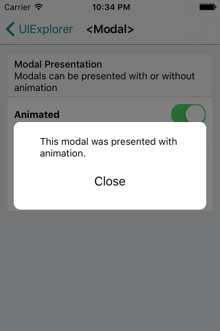

Modal组件可以用来覆盖包含React Native根视图的原生视图（如UIViewController，Activity）。

在嵌入React Native的混合应用中可以使用Modal。Modal可以使你应用中RN编写的那部分内容覆盖在原生视图上显示。

在从根视图开始就使用RN编写的应用中，你应该使用Navigator来代替Modal。通过一个最顶层的Navigator，你可以通过configureScene属性更加方便的控制如何将模态场景覆盖显示在你App其余的部分上。

### 截图


### 属性

<div class="props">
    <div class="prop"><h4 class="propTitle"><a class="anchor" name="animated"></a>animated <span
            class="propType">bool</span> <a class="hash-link" href="#animated">#</a></h4></div>
    <div class="prop"><h4 class="propTitle"><a class="anchor" name="animated"></a>animationType  <span
            class="propType">enum('none', 'slide', 'fade')</span> <a class="hash-link" href="#animationType ">#</a></h4>
        <div class="deprecated">
            <div class="deprecatedTitle"><span>已过期</span></div>
            <div class="deprecatedMessage">
                <div><p>请使用<code>animationType</code> 属性代替。</p></div>
            </div>
        </div>
    </div>
    <div class="prop"><h4 class="propTitle"><a class="anchor" name="onRequestClose"></a>onRequestClose <span
            class="propType">Platform.OS === 'android' ? PropTypes.func.isRequired : PropTypes.func</span> <a
            class="hash-link" href="#onRequestClose">#</a></h4></div>
    <div class="prop"><h4 class="propTitle"><a class="anchor" name="onShow"></a>onShow <span
            class="propType">function</span> <a class="hash-link" href="#onShow">#</a></h4></div>
    <div class="prop"><h4 class="propTitle"><a class="anchor" name="transparent"></a>transparent <span class="propType">bool</span>
        <a class="hash-link" href="#transparent">#</a></h4></div>
    <div class="prop"><h4 class="propTitle"><a class="anchor" name="visible"></a>visible <span
            class="propType">bool</span> <a class="hash-link" href="#visible">#</a></h4></div>
</div>

### 例子

```javascript
'use strict';

var React = require('react');
var ReactNative = require('react-native');
var {
  Modal,
  StyleSheet,
  Switch,
  Text,
  TouchableHighlight,
  View,
} = ReactNative;

exports.displayName = (undefined: ?string);
exports.framework = 'React';
exports.title = '<Modal>';
exports.description = 'Component for presenting modal views.';

var Button = React.createClass({
  getInitialState() {
    return {
      active: false,
    };
  },

  _onHighlight() {
    this.setState({active: true});
  },

  _onUnhighlight() {
    this.setState({active: false});
  },

  render() {
    var colorStyle = {
      color: this.state.active ? '#fff' : '#000',
    };
    return (
      <TouchableHighlight
        onHideUnderlay={this._onUnhighlight}
        onPress={this.props.onPress}
        onShowUnderlay={this._onHighlight}
        style={[styles.button, this.props.style]}
        underlayColor="#a9d9d4">
          <Text style={[styles.buttonText, colorStyle]}>{this.props.children}</Text>
      </TouchableHighlight>
    );
  }
});

var ModalExample = React.createClass({
  getInitialState() {
    return {
      animationType: 'none',
      modalVisible: false,
      transparent: false,
    };
  },

  _setModalVisible(visible) {
    this.setState({modalVisible: visible});
  },

  _setAnimationType(type) {
    this.setState({animationType: type});
  },

  _toggleTransparent() {
    this.setState({transparent: !this.state.transparent});
  },

  render() {
    var modalBackgroundStyle = {
      backgroundColor: this.state.transparent ? 'rgba(0, 0, 0, 0.5)' : '#f5fcff',
    };
    var innerContainerTransparentStyle = this.state.transparent
      ? {backgroundColor: '#fff', padding: 20}
      : null;
    var activeButtonStyle = {
      backgroundColor: '#ddd'
    };

    return (
      <View>
        <Modal
          animationType={this.state.animationType}
          transparent={this.state.transparent}
          visible={this.state.modalVisible}
          onRequestClose={() => {this._setModalVisible(false)}}
          >
          <View style={[styles.container, modalBackgroundStyle]}>
            <View style={[styles.innerContainer, innerContainerTransparentStyle]}>
              <Text>This modal was presented {this.state.animationType === 'none' ? 'without' : 'with'} animation.</Text>
              <Button
                onPress={this._setModalVisible.bind(this, false)}
                style={styles.modalButton}>
                Close
              </Button>
            </View>
          </View>
        </Modal>
        <View style={styles.row}>
          <Text style={styles.rowTitle}>Animation Type</Text>
          <Button onPress={this._setAnimationType.bind(this, 'none')} style={this.state.animationType === 'none' ? activeButtonStyle : {}}>
            none
          </Button>
          <Button onPress={this._setAnimationType.bind(this, 'slide')} style={this.state.animationType === 'slide' ? activeButtonStyle : {}}>
            slide
          </Button>
          <Button onPress={this._setAnimationType.bind(this, 'fade')} style={this.state.animationType === 'fade' ? activeButtonStyle : {}}>
            fade
          </Button>
        </View>

        <View style={styles.row}>
          <Text style={styles.rowTitle}>Transparent</Text>
          <Switch value={this.state.transparent} onValueChange={this._toggleTransparent} />
        </View>

        <Button onPress={this._setModalVisible.bind(this, true)}>
          Present
        </Button>
      </View>
    );
  },
});

exports.examples = [
  {
    title: 'Modal Presentation',
    description: 'Modals can be presented with or without animation',
    render: () => <ModalExample />,
  },
];

var styles = StyleSheet.create({
  container: {
    flex: 1,
    justifyContent: 'center',
    padding: 20,
  },
  innerContainer: {
    borderRadius: 10,
    alignItems: 'center',
  },
  row: {
    alignItems: 'center',
    flex: 1,
    flexDirection: 'row',
    marginBottom: 20,
  },
  rowTitle: {
    flex: 1,
    fontWeight: 'bold',
  },
  button: {
    borderRadius: 5,
    flex: 1,
    height: 44,
    alignSelf: 'stretch',
    justifyContent: 'center',
    overflow: 'hidden',
  },
  buttonText: {
    fontSize: 18,
    margin: 5,
    textAlign: 'center',
  },
  modalButton: {
    marginTop: 10,
  },
});
```
