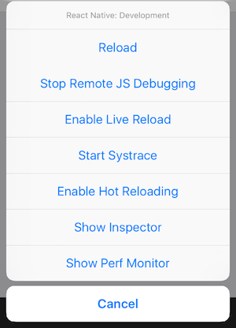

## 访问App内的开发菜单

你可以通过摇晃设备或是选择iOS模拟器的"Hardware"菜单中的"Shake Gesture"选项来打开开发菜单。另外，如果是在iOS模拟器中运行，还可以按下**`Command`**`⌘` + **`D`** 快捷键，Android模拟器对应的则是**`Command`**`⌘` + **`M`**（windows上可能是F1或者F2）。



> 注意：在成品（release/producation builds）中开发者菜单会被关闭。

## 刷新JavaScript

传统的原生应用开发中，每一次修改都需要重新编译，但在RN中你只需要刷新一下JavaScript代码，就能立刻看到变化。具体的操作就是在开发菜单中点击"Reload"选项。也可以在iOS模拟器中按下**`Command`**`⌘` + **`R`** ，Android模拟器上对应的则是按两下**`R`**。（注意，某些RN版本可能在windows中reload无效，请等待官方修复）

> 如果在iOS模拟器中按下**`Command`**`⌘` + **`R`**没啥感觉，则注意检查Hardware菜单中，Keyboard选项下的"Connect Hardware Keyboard"是否被选中。

### 自动刷新

选择开发菜单中的"Enable Live Reload"可以开启自动刷新，这样可以节省你开发中的时间。

更神奇的是，你还可以保持应用的当前运行状态，修改后的JavaScript文件会自动注入进来（就好比行驶中的汽车不用停下就能更换新的轮胎）。要实现这一特性只需开启开发菜单中的[Hot Reloading](https://facebook.github.io/react-native/blog/2016/03/24/introducing-hot-reloading.html)选项。

> 某些情况下hot reload并不能顺利实施。如果碰到任何界面刷新上的问题，请尝试手动完全刷新。

但有些时候你必须要重新编译应用才能使修改生效：

* 增加了新的资源(比如给iOS的`Images.xcassets`或是Andorid的`res/drawable`文件夹添加了图片)
* 更改了任何的原生代码（objective-c/swift/java）

## 应用内的错误与警告提示（红屏和黄屏）

红屏或黄屏提示都只会在开发版本中显示，正式的离线包中是不会显示的。

### 红屏错误

In-app errors are displayed in a full screen alert with a red background inside your app. This screen is known as a RedBox. You can use `console.error()` to manually trigger one.

### 黄屏警告

Warnings will be displayed on screen with a yellow background. These alerts are known as YellowBoxes. Click on the alerts to show more information or to dismiss them.

As with a RedBox, you can use `console.warn()` to trigger a YellowBox.

YellowBoxes can be disabled during development by using `console.disableYellowBox = true;`. Specific warnings can be ignored programmatically by setting an array of prefixes that should be ignored: `console.ignoredYellowBox = ['Warning: ...'];`

> RedBoxes and YellowBoxes are automatically disabled in release (production) builds.

## 访问控制台日志

You can display the console logs for an iOS or Android app by using the following commands in a terminal while the app is running:

```
$ react-native log-ios
$ react-native log-android
```

You may also access these through `Debug → Open System Log...` in the iOS Simulator or by running `adb logcat *:S ReactNative:V ReactNativeJS:V` in a terminal while an Android app is running on a device or emulator.

## Chrome开发者工具

To debug the JavaScript code in Chrome, select "Debug JS Remotely" from the Developer Menu. This will open a new tab at <http://localhost:8081/debugger-ui>

Select `Tools → Developer Tools` from the Chrome Menu to open the [Developer Tools](https://developer.chrome.com/devtools). You may also access the DevTools using keyboard shortcuts (**`Command`**`⌘` + **`Option`**`⌥` + **`I`** on Mac, **`Ctrl`** + **`Shift`** + **`I`** on Windows). You may also want to enable [Pause On Caught Exceptions](http://stackoverflow.com/questions/2233339/javascript-is-there-a-way-to-get-chrome-to-break-on-all-errors/17324511#17324511) for a better debugging experience.

> It is [currently not possible](https://github.com/facebook/react-devtools/issues/229) to use the "React" tab in the Chrome Developer Tools to inspect app widgets. You can use Nuclide's "React Native Inspector" as a workaround.

### 使用Chrome开发者工具来在设备上调试

On iOS devices, open the file [`RCTWebSocketExecutor.m`](https://github.com/facebook/react-native/blob/master/Libraries/WebSocket/RCTWebSocketExecutor.m) and change "localhost" to the IP address of your computer, then select "Debug JS Remotely" from the Developer Menu.

On Android 5.0+ devices connected via USB, you can use the [`adb` command line tool](http://developer.android.com/tools/help/adb.html) to setup port forwarding from the device to your computer:

`adb reverse tcp:8081 tcp:8081`

Alternatively, select "Dev Settings" from the Developer Menu, then update the "Debug server host for device" setting to match the IP address of your computer.

> If you run into any issues, it may be possible that one of your Chrome extensions is interacting in unexpected ways with the debugger. Try disabling all of your extensions and re-enabling them one-by-one until you find the problematic extension.

### 使用自定义的JavaScript调试工具来调试

To use a custom JavaScript debugger in place of Chrome Developer Tools, set the `REACT_DEBUGGER` environment variable to a command that will start your custom debugger. You can then select "Debug JS Remotely" from the Developer Menu to start debugging.

The debugger will receive a list of all project roots, separated by a space. For example, if you set `REACT_DEBUGGER="node /path/to/launchDebugger.js --port 2345 --type ReactNative"`, then the command `node /path/to/launchDebugger.js --port 2345 --type ReactNative /path/to/reactNative/app` will be used to start your debugger.

> Custom debugger commands executed this way should be short-lived processes, and they shouldn't produce more than 200 kilobytes of output.

### 在Android上使用[Stetho](http://facebook.github.io/stetho/)来调试 

1. In ```android/app/build.gradle``` , add

   ```gradle
   compile 'com.facebook.stetho:stetho:1.3.1'
   compile 'com.facebook.stetho:stetho-okhttp3:1.3.1'
   ```

2. In ```android/app/src/main/java/com/{yourAppName}/MainApplication.java```, add the following imports : 

   ```java
   import com.facebook.react.modules.network.ReactCookieJarContainer;
   import com.facebook.stetho.Stetho;
   import okhttp3.OkHttpClient;
   import com.facebook.react.modules.network.OkHttpClientProvider;
   import com.facebook.stetho.okhttp3.StethoInterceptor;
   import java.util.concurrent.TimeUnit;
   ```

3. In ```android/app/src/main/java/com/{yourAppName}/MainApplication.java``` add the function:
   ```java
   public void onCreate() {
         super.onCreate();
         Stetho.initializeWithDefaults(this);
         OkHttpClient client = new OkHttpClient.Builder()
         .connectTimeout(0, TimeUnit.MILLISECONDS)
         .readTimeout(0, TimeUnit.MILLISECONDS)
         .writeTimeout(0, TimeUnit.MILLISECONDS)
         .cookieJar(new ReactCookieJarContainer())
         .addNetworkInterceptor(new StethoInterceptor())
         .build();
         OkHttpClientProvider.replaceOkHttpClient(client);
   }
   ```

4. Run  ```react-native run-android ```

5. In a new chrome tab, open : ```chrome://inspect```, click on 'Inspect device' (the one followed by "Powered by Stetho")

## 调试原生代码

When working with native code (e.g. when writing native modules) you can launch the app from Android Studio or Xcode and take advantage of the debugging features (setup breakpoints, etc.) as you would in case of building a standard native app.
 
## 性能监测

You can enable a performance overlay to help you debug performance problems by selecting "Perf Monitor" in the Developer Menu.
